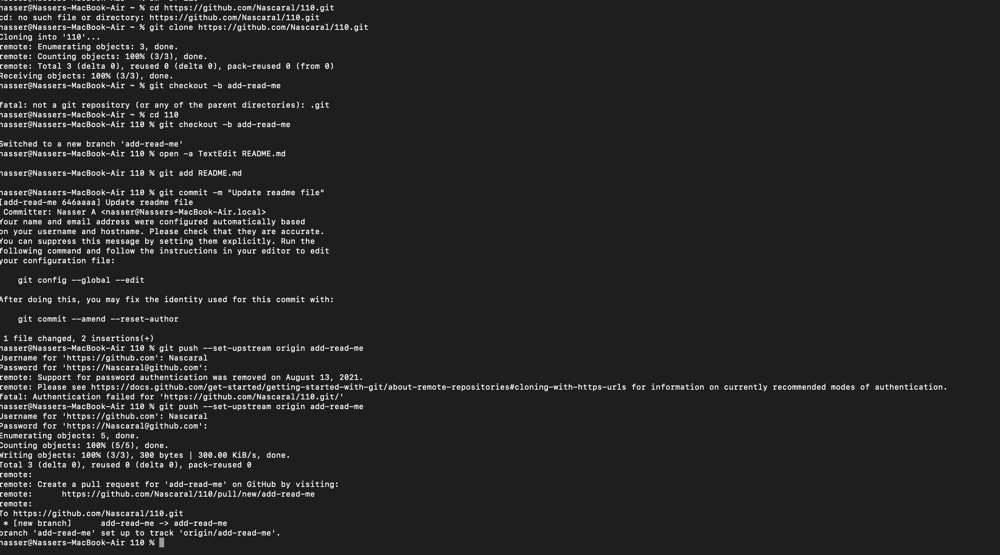
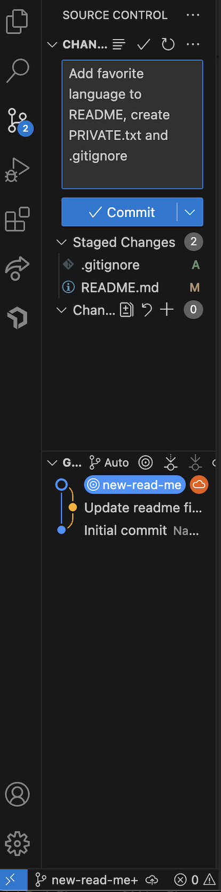

# Nasser's User Page 

Welcome to my GitHub user page! I'm a programmer that loves to build things that make life easier and automate tasks.

---

## My experience as a Programmer

I have experience in:
- Front-end development
- Design

** Languages I use:**
1. JavaScript
2. Python
3. C++

> “Programs must be written for people to read, and only incidentally for machines to execute.” — Harold Abelson

---

## Fun Facts About Me

- [x] Love soccer
- [ ] Professional Boxer
- [x] Have no professional experience

---

## External Links

My life-saving resource: [MDN Web Docs](https://developer.mozilla.org/en-US/)

## Section Links

Want to reach me? [Jump to Contact Info](#contact-info)

## Contact Info

Phone Number: (619) 219-0344
Email: Nalnasser@ucsd.edu

## Relative Link




## Quoting Code

```javascript
function greet(name) {
  console.log(`Hello, ${name}!`);
}


